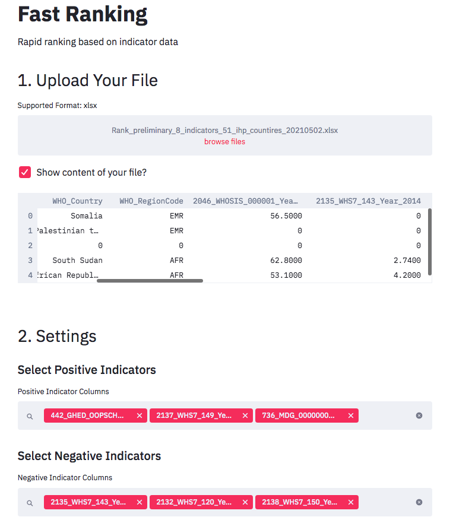
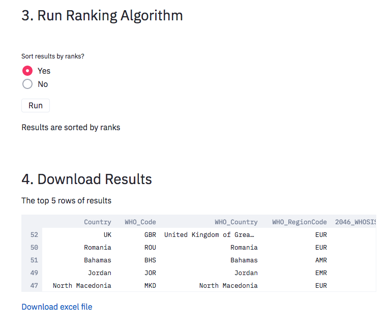

# SWB165-Report

## Fast Ranking App 
### Website
https://fastranking.herokuapp.com
### Overview

 

### Quick Start
1. Upload your `xlsx` file 
    * Numerical columns in your xlsx file will be automatically detected 
    
2. Settings
    * Select positive indicators from numerical columns
    * Select negative indicators from numerical columns 
3. Run ranking algorithm
4. Download ranking results in `xlsx` format

 

## Data Privacy Compliance
 * The application server will not store any users' data (input, output etc).

